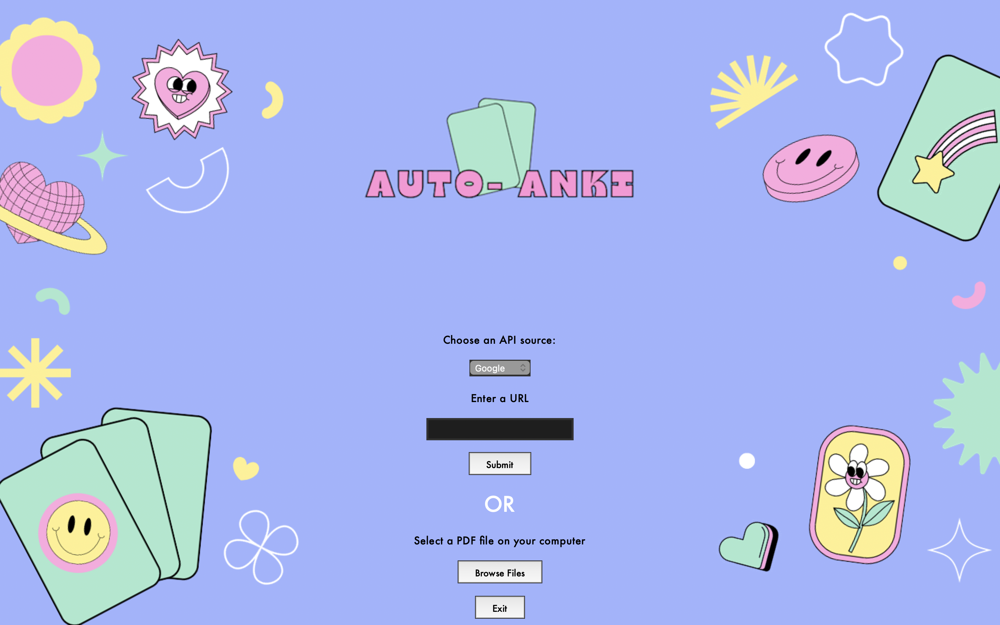
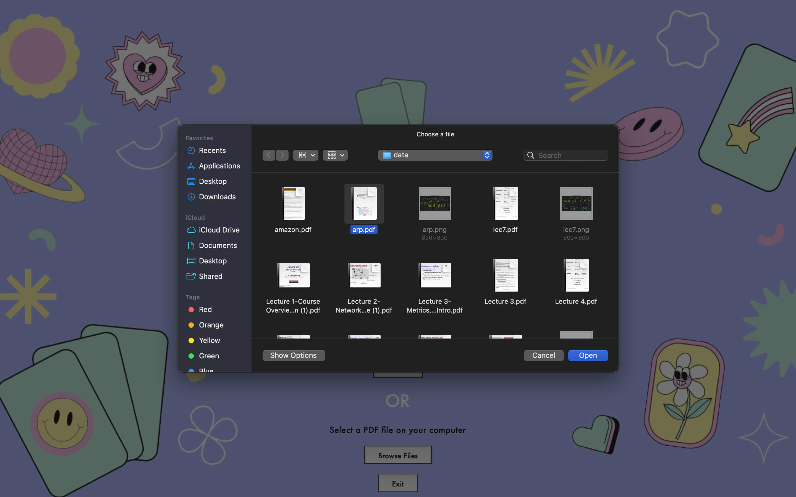
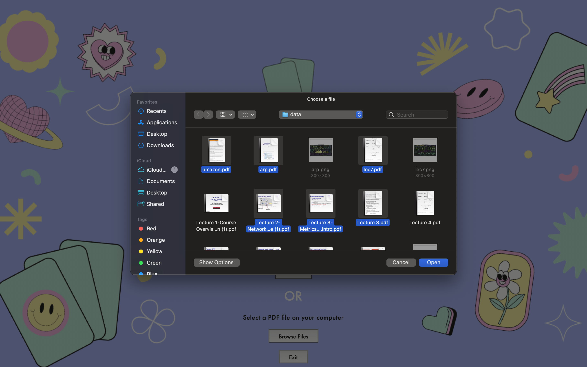
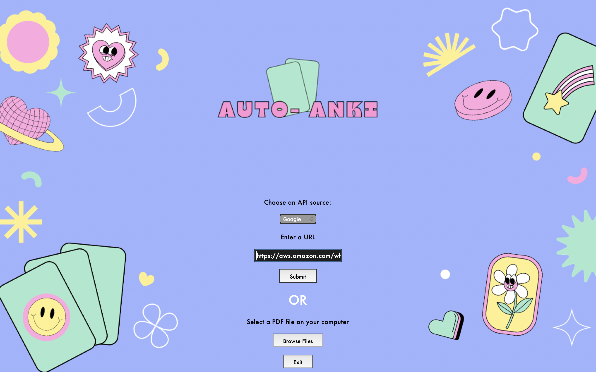
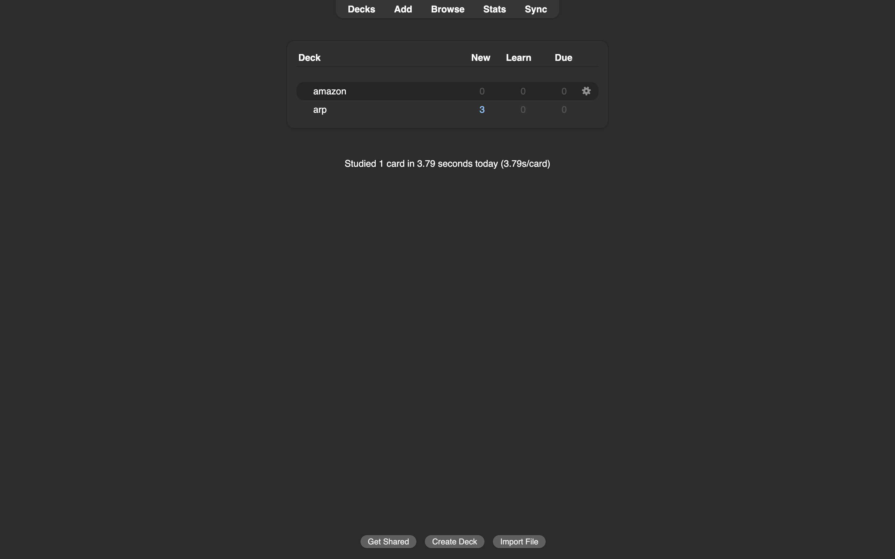

# Functionalities added to the older version:

### First Feature: Enhanced User Interface

We've revamped the user interface and improved the overall aesthetic of the home page. We have also added the support for viewing the application in full screen mode to provide better viewing experience. The UI also adapts to the appearance (light, dark mode) of the system.  

### Second Feature: Selection of multiple files

To provide more immersive experience to the application and avoiding revisits for generating flash decks for each document separately, we have added the support of generating decks for multiple files simultaneously.

Users can select all the files at once to genearate the flash decks.

Here, you can upload a single document:

You can also upload mutliple documents:

### Third Feature: Generate flash decks from a website

We have added the support to generate flash decks from any website on the internet. This enhances the overall use case of the application and improves the user experience.

Just copy the URL of the website, paste it into the dedicated URL section in our application and Voila! your flash decks are ready!!

### Fourth Feature: Integration with Anki Application

Previously, users had to manually load the apkg file of the flash deck into a third party application. With this feature, we enabled the auto loading of the decks into the Anki Application. Say bye to the hassle of manually importing apkgs into a third party application.

